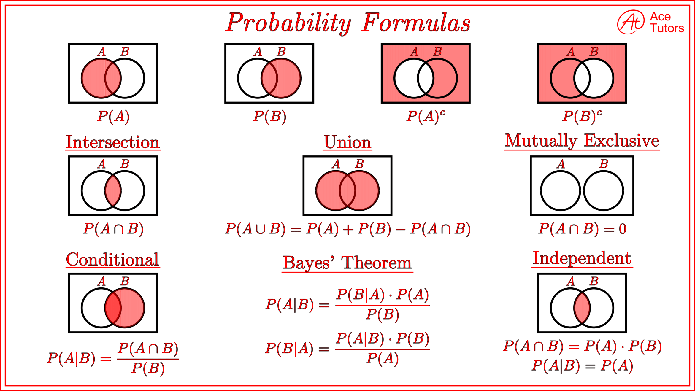

# Probability

## Learning Objective

1.  What is probability?

    - Probability is a measure of the likelihood that a particular event or outcome will occur, expressed as a value between 0 and 1. In ML, probability helps in making predictions, estimating uncertainties, and modeling real-world processes throught techniques like classification, regression, and Bayesian infrerence.

2.  Basic probability notation

    1. P(A): Probability of event A occurring.
    2. P(A ∩ B): Proability of both events A and B occurring, also known as the intersection.
    3. P(A U B): Probability of either event A or event B or both occurring, aldo known as the union.
    4. P(A | B): Conditional probability, meaning the probability of event A occuring given the event B has occurred.
    5. P(Ac): Probability of the complement of event A meaning the probability of A not occuring.
       In ML, these notations help in understanding and calculating probabilities to make predictions, train models and evaluate their performance.

3.  What is independence? What is disjoint?

    - Independence: Two events, A and B, are independent if the occurrence of one event does not influence the probability of the other event. Mathematically, events A and B are independent if P(A ∩ B) = P(A) \* P(B). In ML, independence is often assumed between features in certain models to simplify calculations and reduce computational complexity.

    - Disjoint: Two events, A and B, are disjoint (or mutually exclusive) if the cannot occur at the same time, meaning their intersection is empty. Mathematically, events A and B are disjoint if P(A ∩ B) = 0. Disjoint events are relevant in ML when working with classification tasks, where and observation belongs to only one class, and the classes are mutually exlusive.

4.  What is a union? intersection?

    - The union of two events, A and B, represents the event that either A, B or both occur. In terms of probability, the union is calculated as P(A ∪ B) = P(A) + P(B) - P(A ∩ B). In ML, union can be useful when combining probabilities of multiple events, such as in esemble methods that combine preodictions form different models.

    - Intersection: The intersection of two events, A and B, denoted as A ∩ B, represents the event where both A and B occure simultaneously. In terms of probability, the intersection is claculated as P(A ∩ B). In ML intersections van be useful when evaluating dependencies between events, such as Bayesian nerworks or hidden Markov model, where joint probabilities are required.

5.  What are the general addition and multiplication rules?

    - The general additional rule is used to find the probability of the uniot of two events A and B. I states:

      P(A ∪ B) = P(A) + P(B) - P(A ∩ B)

      This rule takes into account the posibility of A nad B overlapping, so it subrtacts the interseciton to avoid double-counting. In ML, the general rule is useful when combining probabilities of multiple events or predictions, such as in enseble methos or multi-class classificaiton problems.

    - The general multiplication rule is used to find the probability of the intersection of two events A nad B. It states:

      P(A ∩ B) = P(A) _ P(B | A) = P(B) _ P(A | B)

      This rule generalizes the multiplicaiton of probabilities for both independent and dependent events.

      In ML, the general multiplication rule is helpful when working with joint probabilities, such as Bayesian networds, hidden Markov models, or conditional probabilities calculations.

6.  What is a probability distribution?

    - Probability distribution is a funciton that describes the likhood of diffretn outcomes or events in an experiment or random preocess. It assigns a probability to each possible outcome, with the sum of all probabilities equal to 1.

      There are two type of probability distributions:

      1. Discrete Probability Distribution: Deals with discrete outcomes or events, such as the number of heads in a coin toss.

      2. Continuous Probability Distribution: Deals wiht continuous outcomes or evnets, sucha s the height of a peerson or the weight of an object.

      In ML, probability distributions play a critical role in modeling uncertainties, estimating parameters, and making predicitons. They are used in various algorithms, such as Bayesian inference, probabilistic graph8ical models, and generative moderls like GANs.

7.  What is a probability distribution function? probability mass function?

    - Probability Distribution Function(PDF): A PDF is associated with continuous probability distributions. It is a funcitno that describes the likehood of different continous outomces in a random proecess. The PDF represent5s the density of probabilities at a given point, and the area under the cuve between two points given the probability of the outcome lying with the range. Siucne it's a density function the inegral of the PDF over the entire range of possible calues equals 1.

      In ML, PDFs are used to model continous data, estimate parameters, and make predicitons, particularly in regression tasks and generative models.

    - Probability Mass Function (PMF): A PMF is associated with discrete probability distributions. It is a function that assigns a probability to each possible discrete outcome in random process. The sum of all probabilities in PMF equals 1, as it represents the probabilities of all possible outcomes.

      in ML,PMFs are used to model discrete data classify observations, and estimate probabilities of different outcomes, particularly in classificaiton tasks and countbased models like Poisson regression.

8.  What is a cumulative distribution function (CDF)?

    - Is a funciton that represents the probability that a random cariable takes on a value less than or equal to a given value. It is applicable to both discrete and continous probability distributions.

      For a continous probability distribution with a (PDF) f(x), the CDF F(x) is given by the integral:

      F(x) = ∫f(t) dt from -∞ to x

      For a discrete probability distribution with a Probability Mass Funciton (PMF) P(X), the CDF F(x) is given by the sum:

      F(x) = Σ P(X ≤ x) for all possible values of X

      In ML, CDFs are used to calculate perventiles, quantiles, and other summary statistics, as wll as the estimate thresholds in classification tasks and anomaly detention.

9.  What is a percentile?

    - Apercentile is a measure that indicates the relative standing of a value with a datase or a probability distribution. the p-th percentile of a dataset is the value below wich p% of a data points fall. In ML, percentiles are used for understanding data distributions, detecting outliers, and assessing model performance. They can also be used to set threshold in classification tasks, split datasets, or apply data transfomrations like normalization of scaling.

10. What is mean, standard deviation, and variance?

    - Mean (or average) of a dataset is the sum of all calues divided by the total of number of values. In ML, the mean is used to summarize data, estimate parameters, and calculate error metrics like Mean Squared Error (MSE).

      Formula: μ = (Σx_i) / N, where x_i are the data points and N is the total number of data points.

    - Variance: The variance is a measure of the dispersion or spread of a dataset. It represents the avarage squared distance of each data point from the mean. In ML, cariance is useful for understanding data distributions and estimating model uncertainty.

      Formula: σ^2 = (Σ(x_i - μ)^2) / N, where x_i are the data points, μ is the mean, and N is the total number of data points.

    - Standard Deviation: The standard deviation is the square root of the variance. It is also a measure of dispersion, but ont he same scale of the data itself. In ML, the standard deviation is used to analyze data variability, set thersholds, and apply data trasnformations like standardization.
      Formula: σ = √(Σ(x_i - μ)^2) / N, where x_i are the data points, μ is the mean, and N is the total number of data points.

11. Common probability distributions

    1. Bernoulli Distribution: Describes the probability of success (1) or failure (0) in a single binary experiment. It's used in binary classification tasks and feature selection.

    2. Binomial Distribution: Describes the number of successes in a fixed number of Bernoulli trials. It's used in multi-label classification and modeling count-based binary data.

    3. Poisson Distribution: Represents the number of events occurring in a fixed interval of time or space. It's used in modeling rare events, count-based data, and Poisson regression.

    4. Normal (Gaussian) Distribution: A continuous distribution defined by its mean and standard deviation, with a bell-shaped curve. It's used in regression tasks, parameter estimation, and as an assumption in many statistical tests and ML models (e.g., linear regression).

    5. Exponential Distribution: Describes the time between events in a Poisson process. It's used in modeling waiting times, survival analysis, and reliability.

    6. Gamma Distribution: A continuous distribution that generalizes the exponential distribution, used in modeling waiting times, Bayesian inference, and modeling continuous data with skewed distributions.

    7. Uniform Distribution: All outcomes have equal probability. It's used in random sampling, initialization of model parameters, and random search for hyperparameters.
